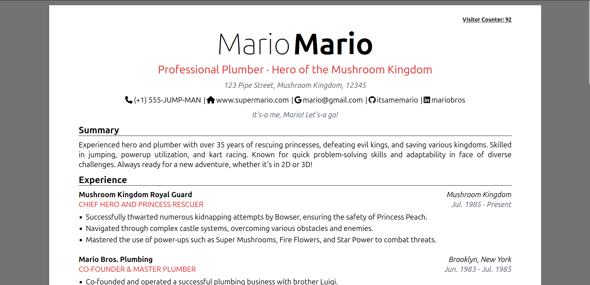
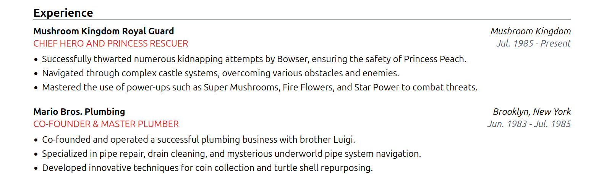

# Vue3 Awesome CV Template

**Vue3 Awesome CV Template** is a Vue3 version of [Awesome CV](https://github.com/posquit0/Awesome-CV) for a CV(Curriculum Vitae) or Résumé. Using Vue SFC (Single File Components) and JSON, it is very easy to use and greatly customizable, and also support mobile responsiveness.

## Screenshots

| Web | Mobile |
|:---:|:---:|
|   | |

## Components

| Component | Screenshot |
|:---:|:---:|
| DetailListing |  |
| MinimalListing |  |
| TableList |  |

## Quick Start

1. Clone this repository and install the dependencies

    ```sh
    npm install
    ```

2. Run the development server

    ```sh
    npm run dev
    ```

## Customization

Go to `public` directory and edit `resume.json` or `styles.json` file to customize your CV. Keep the structure of the JSON file as it is especially the keys.

The loading screen image and text can be switched by replacing `public/mario-jump.gif` file and changing the file path in `styles.json`.

```json
 "loadingScreen": {
    "imageUrl": "/mario-jump.gif",
    "text": "Here we go... preparing your adventure!"
  }
```

## Visitor Counter API

This repository is a submodule of [k3ii/mscc-cloud-resume-challenge](https://github.com/k3ii/mscc-cloud-resume-challenge), which required the implemention of a visitor counter API using AWS services such as API Gateway, Lamdba and DynamoDB.

You can implement your own visitor counter API to extend the *AWESOMENESS* of your resume and add the endpoint in `.env` file.

```env
VUE_APP_SET_VISITOR_COUNT_API=""
VUE_APP_INCREMENT_VISITOR_COUNT_API=""
```

If you don't want to use the visitor counter API, you just need to keep the values of the above environment variables empty .

## For Production

- To type-check, compile and minify

    ```sh
    npm run build
    ```

- Lint with [ESLint](https://eslint.org/)

    ```sh
    npm run lint
    ```

## Deploy to GitHub Pages

1. Change the `base` path in `vite.config.ts` to your repository name
2. Push the changes to `main` branch as `GitHub Actions` will build and automatically deploy to GitHub Pages
3. (Optional) If you want to deploy in a different branch, update `Deployment branches and tags` in your repository `Settings/Environment/Configure github-pages`.

## Credit

- [Awesome CV](https://github.com/posquit0/Awesome-CV)
